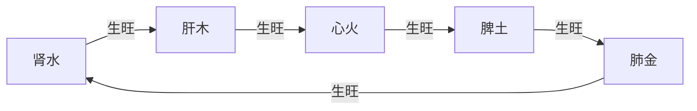
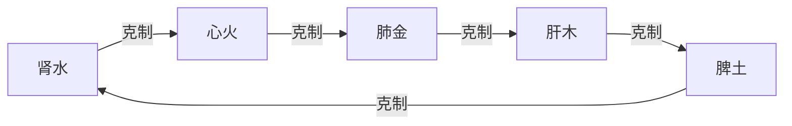
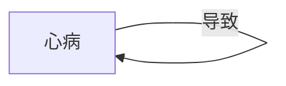
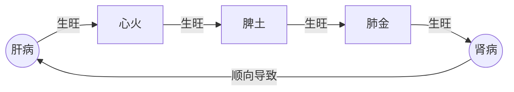
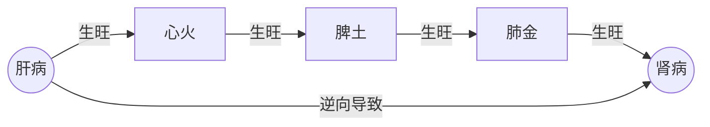
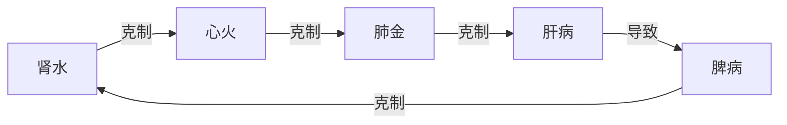

> 人体的阴阳
# 双手的阴阳
比如自己的双手，上边皮肤、毛孔、血管、肌肉等能用眼睛看到的部分，这就是阴。而手的功能，比如力量大小你看不到，这些看不到的功能，就是阳。
阴阳和合，就是道
# 脏器的阴阳
比如自己的心脏，肌肉、血管、血液、筋膜等能用眼睛看到有形有质的部分，这就是阴。而心脏的功能，比如跳动的节奏、泵血的能力你看不到，这些看不到的功能，就是阳。
# 五脏生克
>五脏相生关系

>五脏相克关系

# 五脏病理(五邪）
>正邪

心自身本经有病，病症也表现在心脏，就是正邪。

>虚邪

比如：肾脏有病，但是顺向反映在肝脏有病

针灸：虚则补其母
>实邪

比如：肝脏有病，但是逆向反映在肾有病

针灸：实则泻其子
>贼邪

比如：肝脏有病，但是逆向反映在肾有病

# 治疗原则
>虚则补其母

肝木表现有虚邪则应补益肾水，肾水有虚邪则应补益肺金等等
>实则泻其子

肝木有实邪则泄心火，心旺则泄
>子能令母实

>母能令子虚

<!--stackedit_data:
eyJoaXN0b3J5IjpbMTA0NDExOTg3OF19
-->